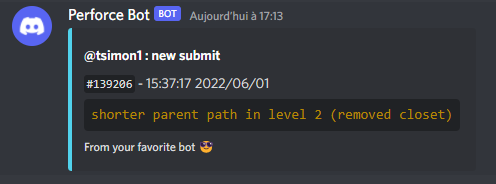

# Perforce Discord Submit logger 📫
A simple python program to use with perforce triggers that will notify a provided discord channel when changes have been submitted to a perforce repository. Forked from https://github.com/TibRib/Perforce-discord-botlogger



# Requirements
The app is a python script that uses the [p4 changes](https://www.perforce.com/manuals/cmdref/Content/CmdRef/p4_changes.html) command, you need to make sure you have a constant access to `p4 changes`.
You can try to run ```p4 changes -m 1``` to see if you are connected.

## Python requirements
Make sure to run
```
cd app
pip install -r requirements.txt
``` 
before first running the program (python3 required of course).

# Configuration
You need to configure some options declared in the `config.ini` file:
```ini
[Discord]
webhook = YOUR_WEBHOOK_URL_HERE

[Perforce]
target = //YOUR_PERFORCE_DEPOT/...
user = YOUR_PERFORCE_USER_NAME

[ApplicationSettings]
signature = "Your Signature Goes Here"
```
If you don't know how to obtain a discord webhook url for your text channel, take a look at [this discord article](https://support.discord.com/hc/en-us/articles/228383668-Intro-to-Webhooks).

## Setting Up The Trigger
Run `p4 triggers` command on terminal, and add the trigger entry as:

```
Triggers:
	discord change-commit //YOUR_PERFORCE_DEPOT/... "python3 <app.py location> %changelist% &"
```

# Licence and credits
The licence for this project is MIT.

The project is inspired by Perforce Commit Logger, by James Ives.  https://github.com/JamesIves/perforce-commit-discord-bot
